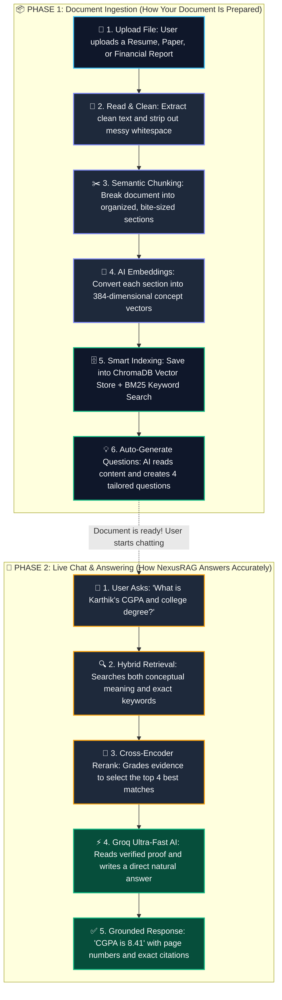
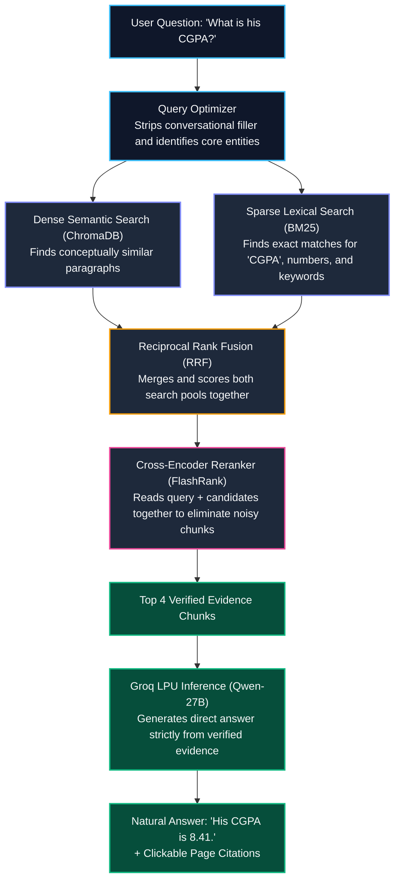

# NexusRAG — Complete RAG Lifecycle Platform

[](https://nexus-doc-rag.streamlit.app/)
[](https://github.com/katta-karthik/Nexus_RAG)

[](https://streamlit.io)
[](https://python.langchain.com)
[](https://groq.com)
[](https://www.trychroma.com)
[](https://github.com/PrithivirajDamodaran/FlashRank)
[](https://www.python.org/)
[](LICENSE)

> **An enterprise-grade, end-to-end RAG Lifecycle Platform demonstrating the complete retrieval-augmented generation lifecycle — from ingestion, text cleaning, and recursive chunking to hybrid dense-sparse retrieval (BM25 + ChromaDB with Reciprocal Rank Fusion), cross-encoder reranking, live lifecycle flowcharts, dynamic document-specific question synthesis, and grounded natural language chat with verifiable citations.**

> 🚀 **Live Demo:** Try NexusRAG in your browser right now at **[https://nexus-doc-rag.streamlit.app/](https://nexus-doc-rag.streamlit.app/)**

---

## 🌟 How It Works (At a Glance)

Most RAG tutorials treat document retrieval like a black box: *you upload a file, and an AI magically chats with it*. 

In production, black-box RAG often hallucinates, misses exact numbers (like a GPA or financial revenue), or produces messy paragraph dumps. **NexusRAG** solves this with a **complete 2-phase lifecycle**:



---

## ⚡ The 7-Stage Live Ingestion Flowchart

When you upload or select a document, NexusRAG does not show a blank loading spinner. Instead, it displays an **interactive 7-stage flowchart** in the UI that lights up stage-by-stage as your document is processed:

```mermaid
flowchart LR
    classDef stage fill:#0f172a,stroke:#10b981,stroke-width:2px,color:#f8fafc;

    S1["📥 STAGE 01<br/><b>Ingestion</b><br/>Validate PDF/TXT"]:::stage
    S2["📄 STAGE 02<br/><b>Parsing</b><br/>Extract Text & Pages"]:::stage
    S3["🧹 STAGE 03<br/><b>Cleaning</b><br/>Strip Noise & Artifacts"]:::stage
    S4["✂️ STAGE 04<br/><b>Chunking</b><br/>Recursive Split (800/120)"]:::stage
    S5["🧬 STAGE 05<br/><b>Embeddings</b><br/>MiniLM 384-d Vectors"]:::stage
    S6["🗄️ STAGE 06<br/><b>Hybrid Index</b><br/>ChromaDB + BM25"]:::stage
    S7["💡 STAGE 07<br/><b>AI Questions</b><br/>4 Tailored Questions"]:::stage

    S1 --> S2 --> S3 --> S4 --> S5 --> S6 --> S7
```



### What Happens at Each Stage (In Simple Terms):

| Stage | Name | What It Does | Why It Matters |
| :---: | :--- | :--- | :--- |
| **01** | **Ingestion** | Reads and verifies the file bytes (PDF, TXT, MD). | Ensures corrupt or unsupported files fail fast before wasting compute. |
| **02** | **Parsing** | Extracts raw text and preserves original page boundaries. | Enables precise citations (e.g. knowing a fact was found on Page 2). |
| **03** | **Cleaning** | Normalizes line breaks, whitespace, and Unicode artifacts. | Prevents messy formatting from diluting vector search quality. |
| **04** | **Chunking** | Splits text into overlapping 800-character segments. | LLMs have finite context; chunks isolate facts without losing context. |
| **05** | **Embeddings** | Converts text chunks into mathematical vectors (384-d). | Allows the computer to understand the semantic *meaning* of words. |
| **06** | **Hybrid Index** | Writes to ChromaDB (vector) and BM25 (keyword index). | Combines conceptual search with exact keyword and number matching. |
| **07** | **AI Questions** | Groq AI scans the document and synthesizes 4 smart questions. | Users immediately know what to ask based on the specific document. |

---

## 🔍 How Hybrid Search & Reranking Prevents Hallucinations

Standard RAG systems rely solely on vector search, which often misses exact figures (like a specific CGPA, date, or revenue number). NexusRAG implements **Dense + Sparse Hybrid Search with Cross-Encoder Reranking**:



---

## 🚀 Key Features

### 1. 📥 Single Unified Upload Experience
- **Frictionless Ingestion:** Clean, single drag-and-drop zone supporting `.pdf`, `.txt`, and `.md` documents.
- **1-Click Ready Samples:** Instant test documents built right into the home screen:
  - 👤 **Software Engineer Resume** — *Karthik Katta (B.Tech CSE • 8.41 CGPA • AI Projects)*
  - 🔬 **AI Research Paper** — *'Attention Is All You Need' (Transformer Architecture)*
  - 📊 **Annual Financial Report** — *TechCorp ($4.2B Revenue • Segment Margins)*

### 2. 💡 Dynamic, Content-Tailored Suggested Questions
No more generic questions like *"What is the company's financial growth?"* when you upload a resume!
- Once a document is ingested, our `DocumentQuestionSuggester` analyzes the content using Groq (`qwen/qwen3.8-27b`).
- **If you upload a resume**, it automatically generates tailored question pills:
  - `👉 What is Karthik's CGPA and which university did he graduate from?`
  - `👉 Which AI and GenAI frameworks are listed in his technical skills?`
  - `👉 What improvements did he achieve during his internship at NexaTech Solutions?`
  - `👉 What are the key features of the NexusRAG project?`
- **If you upload a research paper**, it asks about attention formulas, architecture differences, and experimental BLEU benchmarks.
- Clicking any suggested question immediately populates the chat and runs the RAG pipeline!

### 3. 💬 Grounded Natural Language Chat
- **Direct & Conversational:** Powered by Groq's high-speed inference engine (`qwen/qwen3.8-27b`), producing clean, natural language answers without raw chunk dumps.
  - *Example Query:* "what is his cgpa"
  - *Direct Answer:* **"Karthik Katta graduated from VNR Vignana Jyothi Institute of Engineering and Technology with a CGPA of 8.41."**
- **Verified Citations:** Every response includes collapsible source references with document name, page numbers, match relevance scores, and verbatim excerpts.
- **Transparent RAG Lifecycle Trace:** Expandable trace revealing rewritten queries, candidate pool sizes, and reranked selections.

### 4. 📂 Full Document CRUD (Create, Read, Update, Delete)
- **Create / Add:** Drag and drop new documents or load sample benchmarks anytime.
- **Read / List:** The sidebar actively displays all indexed documents with page and chunk counts.
- **Delete / Remove:** Individual `🗑️` delete buttons remove a document's vectors from ChromaDB and dynamically rebuild the BM25 index. Includes a **Clear All Knowledge** button.
- **Inspect Chunks:** An expandable chunk inspector lets you examine chunk text, token counts, and metadata payloads under the hood.

---

## 📁 Repository Structure

```text
Nexus_RAG/
├── nexusrag/
│   ├── ingestion/
│   │   ├── loaders.py          # PDF (PyPDF), TXT, MD multi-format parsing
│   │   ├── cleaner.py          # Whitespace & Unicode artifact normalization
│   │   ├── chunker.py          # Recursive boundary splitting with overlap
│   │   └── metadata.py         # Provenance enrichment & token hashing
│   ├── indexing/
│   │   ├── embeddings.py       # 384-d MiniLM, Gemini, OpenAI & Local Embeddings
│   │   └── vectorstore.py      # Chroma collection manager with cosine space
│   ├── retrieval/
│   │   ├── semantic.py         # Dense vector similarity retriever
│   │   ├── keyword.py          # BM25 Okapi lexical retriever
│   │   ├── hybrid.py           # Reciprocal Rank Fusion (RRF) candidate merger
│   │   ├── query_rewrite.py    # Groq & rule-based query reformulator
│   │   ├── multi_query.py      # Multi-perspective sub-query generator
│   │   └── reranker.py         # FlashRank CPU cross-encoder reranker
│   ├── generation/
│   │   ├── prompts.py          # Anti-hallucination grounded prompts
│   │   ├── answer.py           # Groq streaming generator with citations
│   │   └── suggestions.py      # Document-specific suggested questions engine
│   ├── graph/
│   │   └── rag_graph.py        # LangGraph StateGraph orchestration pipeline
│   ├── ui/
│   │   ├── components.py       # Active doc banner, chunk cards, citations
│   │   ├── flowchart.py        # 7-stage interactive visual flowchart renderer
│   │   └── styles.py           # Modern executive CSS styling
│   └── mcp/
│       └── server.py           # Fast JSON-RPC MCP document operations server
├── sample_docs/
│   ├── sample_resume_karthik.txt             # Realistic software engineer resume
│   ├── attention_is_all_you_need_summary.txt # AI research paper benchmark
│   └── techcorp_annual_report_2025.txt       # Enterprise financial report benchmark
├── tests/
│   └── test_rag_lifecycle.py   # Complete end-to-end unit & lifecycle tests
├── app.py                      # Main Streamlit web application
├── requirements.txt            # Production dependencies
├── .env.example                # Environment configuration template
├── .gitignore                  # VCS ignore rules
└── README.md                   # Platform documentation
```

---

## 🌐 Live Web Application

NexusRAG is deployed and accessible without installing anything locally:
👉 **[https://nexus-doc-rag.streamlit.app/](https://nexus-doc-rag.streamlit.app/)**

- **Instant Ingestion:** Upload your own PDF resume, research paper, or financial report.
- **Visual Flowchart:** Watch the 7-stage RAG lifecycle execute live.
- **Interactive Chat:** Ask questions and receive grounded, cited natural language answers.

---

## ⚡ Quick-Start (Run Locally)

### 1. Clone Repository & Install Dependencies
```bash
git clone https://github.com/katta-karthik/Nexus_RAG.git
cd Nexus_RAG

# Create virtual environment
python -m venv venv
source venv/bin/activate  # On Windows: venv\Scripts\activate

# Install requirements
pip install -r requirements.txt
```

### 2. Configure Environment Variables
Copy `.env.example` to `.env`:
```bash
cp .env.example .env
```
Add your **Groq API Key** (for ultra-fast natural language answers and question synthesis):
```env
GROQ_API_KEY=gsk_your_groq_api_key_here
```
*(Optional: `GOOGLE_API_KEY` or `OPENAI_API_KEY` can also be used)*

> **Offline Demo Mode:** NexusRAG includes a built-in **Local Deterministic Vectorizer & Extractive Synthesizer**, allowing complete demonstration even without any API keys!

### 3. Launch Streamlit Application
```bash
streamlit run app.py
```
Open your browser at **`http://localhost:8501`**.

### 4. Run Unit & Lifecycle Tests
```bash
python -m unittest tests/test_rag_lifecycle.py
```

---

## ⏱️ 2-Minute Walkthrough (For Recruiters & Evaluators)

1. **Step 1 — Ingest a Document:** On the home screen, click **`👤 Resume — Karthik Katta`** (or drag and drop your own PDF resume).
2. **Step 2 — Watch the RAG Lifecycle Flowchart:** Watch the 7 visual stages light up sequentially with real metrics:
   - *Validating ➔ Extracting Pages ➔ Filtering Noise ➔ Creating Chunks ➔ Embedding 384-d Vectors ➔ Indexing Chroma + BM25 ➔ Synthesizing Questions.*
3. **Step 3 — Inspect Dynamic Suggested Questions:** On the chat screen, notice the 4 questions tailored specifically to the resume (e.g. CGPA, technical skills, internships).
4. **Step 4 — Ask in Natural Language:** Click **`👉 What is Karthik's CGPA and which university did he graduate from?`** (or type your own question).
5. **Step 5 — Verify Grounding & Citations:** Observe the instant, direct answer:
   > *"Karthik Katta graduated from VNR Vignana Jyothi Institute of Engineering and Technology with a CGPA of 8.41."*
   Open the citation cards to inspect the verbatim source excerpts and view the RAG retrieval trace.
6. **Step 6 — Test Document CRUD:** In the sidebar, click the `🗑️` button to delete the document or click **`➕ Upload Another Document`** to index a second document.

---

## 🔬 Retrieval Strategy Comparison

| Retrieval Strategy | Exact Entity Matching | Conceptual Understanding | Noisy Chunk Filtering | Speed (ms) |
| :--- | :---: | :---: | :---: | :---: |
| **BM25 Lexical** | ⭐⭐⭐⭐⭐ | ⭐⭐ | ⭐⭐ | ~5ms |
| **Dense Semantic Vector** | ⭐⭐⭐ | ⭐⭐⭐⭐⭐ | ⭐⭐⭐ | ~25ms |
| **Hybrid Search (RRF)** | ⭐⭐⭐⭐⭐ | ⭐⭐⭐⭐⭐ | ⭐⭐⭐ | ~30ms |
| **Hybrid + Cross-Encoder Rerank** | **⭐⭐⭐⭐⭐** | **⭐⭐⭐⭐⭐** | **⭐⭐⭐⭐⭐** | **~45ms** |

---

## 📄 License
This project is licensed under the Apache 2.0 License.
